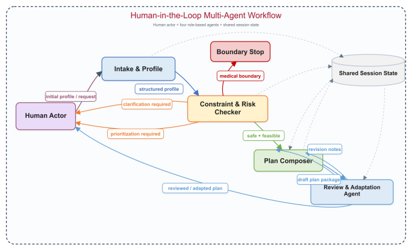

## Project Information

- **Project title:** Constraint-Aware Fitness Planner
- **Team:** Shiwei Jiang
- **Selected track:** Track B
- **Artifact type:** usable local browser artifact with scenario-based evaluation, supporting technical evidence, and final documentation
- **Repository:** https://github.com/Shiwei-Jiang/multi-agents-project-constraint-aware-fitness-planner.git

## Problem and Target User

Constraint-Aware Fitness Planner is designed for a user who wants help building a realistic diet and workout plan under everyday constraints such as food intolerances, symptom-trigger history, optional body-context notes, limited equipment, limited training time, budget limits, and adherence challenges. The target user is not seeking medical diagnosis. Instead, they need a planning workflow that stays in non-clinical scope while still handling ambiguity, conflicts, and revision after breakdown or adherence failure.

The project also serves operational stakeholders around the user, such as a trainer or coach, a licensed dietitian, or a referring provider who needs to see why the system proceeded, paused, stopped, or revised a plan. That requirement drove the emphasis on inspectable traces, explicit state, published handoff packets, and saved outputs. This wording follows the Phase 1 feedback directly: the grader is the audience for this package, not the stakeholder the workflow is designed around.

## Why the Problem Is Agentic

This is not a one-shot content-generation problem. A useful system must decide:

- whether the user profile is complete enough to plan
- whether symptom language is too vague to support safe assumptions
- whether the request crosses a diagnosis or medication boundary
- whether conflicting goals and resources require human prioritization
- whether a draft plan should be revised before delivery
- how to preserve state across post-acceptance execution feedback

Those coordination choices are what make the problem agentic. The value comes from **branching, handoffs, stop conditions, review, and adaptation**, not from text generation alone.

## Final Artifact Summary

The final artifact is a local browser application in `app/` backed by a browser bundle that mirrors the workflow logic in `src/engine.mjs`. The evaluation runner in `scripts/run_evaluation.mjs` uses `src/engine.mjs` directly and exports scenario traces to `outputs/`. This architecture supports a Track B submission by pairing a usable interactive artifact with inspectable scenario evidence, breakdown cases, and reproducible supporting artifacts.

As an interactive prototype, the system allows a reviewer to load scenarios, update user-facing inputs, and observe state transitions and decision outputs in real time. Each interaction is logged on screen and mirrored into exported traces, so the project can be inspected as a working system artifact rather than only as a static write-up.

Interpretation boundary up front:

- the `14 / 14` pass result reported later in this document should be read as **within the project's bounded Phase 3 scope**
- the evidence is based on internal scenario emulation, saved trace inspection, deterministic reruns, and structured manual review rather than an external user study
- the project therefore argues for **process-aware workflow correctness within a stated non-clinical scope**, not universal robustness or production readiness

Key visible behaviors in the artifact:

- role-based workflow trace
- protocol-state transitions
- bounded autonomy and safety stops
- a human prioritization branch
- a reviewed output package separated from the workflow log
- a more delivery-oriented reviewed package that now includes profile-fit summary, sample meal pattern, session blueprint, expanded weekly structure, next-step guidance, and an operational handoff note
- a downloadable reviewed-plan summary so the artifact delivers a user-facing package rather than only a demo trace
- preserved session state across adaptation
- visible checkpoint guidance, trust cues, and version-to-version plan comparison
- visible handoff-ledger packets that make bounded agent coordination more explicit than a controller log alone
- visible allowed next actions for the current protocol state

From a UI design perspective, settings and control affordances are intentionally embedded within the primary interaction surface (Intake and workflow panels), rather than separated into a dedicated configuration page, so that coordination, constraints, and decision context remain visible in a single screen during interaction and review.

The refreshed screenshot set in `screenshots/` now matches those `phase3-v1.6` behaviors directly. In particular, the baseline and revision images show the handoff ledger and stronger deliverable framing, the clarification image shows a paused clarification state together with a live preview that the current wording would still trigger the safety boundary if continued unchanged, and the evaluation page image reflects the current `14 / 14` formal pass table rather than an older partial-failure snapshot.

## How This Meets Phase 3 Requirements

This package is organized so a reviewer can move from **claim** to **evidence** without inferring too much from scattered files.

| Phase 3 requirement or rubric claim | Main evidence | What it demonstrates |
|---|---|---|
| usable interactive artifact | `app/index.html`; `screenshots/01_home.png` | a runnable Track B browser artifact with visible workflow, reviewed output, state, and next actions |
| coordination and branching | `outputs/sample_runs/P3-01_baseline.json`; `outputs/sample_runs/P3-03_prioritization.json`; `outputs/sample_runs/P3-07_revision.json` | bounded agent authority, state transitions, human escalation, and a visible `Review -> Plan Composer -> Review` rewrite path |
| evidence layer is inspectable | `docs/evaluation_evidence_view.html`; `outputs/demo_outputs/end_to_end_trace_baseline.md`; `outputs/exported_artifacts/extended_evaluation_snapshot.json` | reviewer-facing traces, summarized outputs, and machine-readable exports rather than undocumented claims |
| meaningful evaluation coverage | `eval/test_cases.csv`; `eval/evaluation_results.csv`; `outputs/extended_runs/`; `outputs/exported_artifacts/stability_check.json` | baseline correctness, ambiguity handling, governance stops, human tradeoff escalation, adaptation, adversarial robustness, persona variation, and deterministic stability |
| failure analysis and iteration | `eval/failure_log.md`; `eval/version_notes.md`; `outputs/extended_runs/P3-R01_grounding_regression.json`; `outputs/extended_runs/P3-R02_rewrite_visibility_regression.json` | concrete failures were logged, fixed, and then kept visible through regression checks instead of disappearing into prose |
| governance and bounded scope | `outputs/sample_runs/P3-04_medicalBoundary.json`; `outputs/extended_runs/P3-X02_boundary_evasion.json`; Governance section below | non-clinical scope enforcement, ambiguity handling, and refusal to resolve value-laden tradeoffs automatically |

## Track B Fit At A Glance

| Track B requirement | Where it appears | How the package makes it inspectable |
|---|---|---|
| screen-based interactive artifact | `app/index.html` | the browser UI shows intake, workflow output, state, and user-decision checkpoints directly |
| branching / coordination / decision structure | `clarification`, `prioritization`, `medicalBoundary`, `revision`, and `adaptation` scenarios | the same controller exposes different stop, escalation, revision, and completion paths instead of only a happy path |
| evidence or trace layer | workflow log, transition panel, state panel, and exported JSON traces | each scenario exposes both on-screen evidence and a saved artifact in `outputs/sample_runs/` |
| inspectable human-in-the-loop behavior | `awaiting_clarification`, `awaiting_prioritization`, `awaiting_user_acceptance`, and bounded revision states | the workflow shows where the system pauses, resumes, waits, or accepts a human decision rather than hiding those checkpoints |
| evaluation / results visibility | `docs/evaluation_evidence_view.html`, `outputs/demo_outputs/`, and `eval/` | the package includes a reviewer-facing results page plus reproducible exported evidence files |

## Architecture and Role or Component Design

The system keeps the **centralized controller pattern promised in Phase 2**. It is not a decentralized or free-negotiation architecture. However, in the final refinement pass the roles are now represented more explicitly as **agents with bounded decision authority**, and their outputs are visible as structured handoffs in both the trace and the handoff ledger.

The controller remains responsible for protocol-state transitions. The agents remain responsible for producing the structured outputs that authorize those transitions. In other words, the artifact still follows the Phase 2 state-machine design, but the evidence layer now makes coordination look like **agent-driven control under a controller**, rather than a generic pipeline.



### Course design frame: role-based cooperation with centralized control

This architecture follows the course's multi-agent design emphasis on **explicit interaction structures, role-based division of labor, communication infrastructure, and control tradeoffs**. The project uses **role-based cooperation** rather than debate, voting, or decentralized negotiation because the task is safety-sensitive and benefits from clear authority boundaries. Intake, checking, composition, review, and human decision checkpoints each own different parts of the workflow, while the controller keeps the overall protocol auditable.

The design intentionally chooses **centralized coordination** over decentralized agent autonomy. That choice improves traceability, simplifies governance, and makes stop conditions enforceable, at the cost of less open-ended adaptation. In course terms, the project prioritizes right-sized simplicity, controllability, and inspectable handoffs over a more complex multi-agent organization whose emergent behavior would be harder to grade and govern.

| L6 multi-agent design concept | Project implementation | Reason for the choice |
|---|---|---|
| role-based cooperation | Intake, Constraint & Risk Checker, Plan Composer, Review & Adaptation Agent, Human-in-the-Loop | separates responsibilities and makes coordination evidence inspectable |
| centralized coordination | controller-managed protocol states and allowed actions | keeps safety stops, handoffs, and human checkpoints enforceable |
| communication structure | structured handoff packets and shared session state | avoids opaque free-form agent chatter while preserving agent influence |
| coordination tradeoff | bounded policy layer instead of decentralized negotiation | favors auditability and reproducibility over open-ended autonomy |

### Agent ownership and authority

| agent | primary authority | output artifact | who can overrule it |
|---|---|---|---|
| Intake & Profile Builder | normalize raw intake and publish a structured profile packet | profile packet + missing-field signal | Constraint & Risk Checker can block planning if the profile is still insufficient |
| Constraint & Risk Checker | authorize planning, pause for clarification, escalate to human prioritization, or stop at the boundary | constraint report + escalation reason | Human can resolve prioritization; nobody downstream can bypass a boundary stop |
| Plan Composer | publish a first-pass non-clinical draft after planning is authorized | draft plan package | Review & Adaptation Agent can revise or reject draft assumptions before release |
| Review & Adaptation Agent | approve the draft, revise it before release, or adapt it after execution feedback | reviewed package + review notes + change summary | Human can reject the reviewed package and request one more bounded revision |
| Human-in-the-Loop Actor | resolve ambiguity, choose tradeoffs, accept or reject the reviewed package, and provide post-execution evidence | clarification response, prioritization choice, acceptance, or execution feedback | Controller only closes the session after human acceptance |

### Handoff structure

The final artifact now makes the message-passing structure explicit:

- Intake publishes a **structured profile packet** to Constraint & Risk Checker.
- Constraint & Risk Checker publishes either a **constraint report**, a **clarification request**, a **prioritization request**, or a **boundary refusal**.
- Plan Composer publishes a **draft package** to Review & Adaptation Agent.
- Review & Adaptation Agent publishes a **reviewed package** plus **review notes** back to the user-facing checkpoint.
- Human responses can reopen the workflow with a **clarification update**, a **tradeoff decision**, a **revision request**, or **post-execution feedback**.

This keeps the controller intact while making inter-agent influence visible in the saved trace.

### How agents communicate in the current implementation

The agents do **not** communicate through free-form chat. Instead, communication is implemented as controller-routed handoffs over structured artifacts and shared session state:

- each major step publishes a bounded packet such as a profile packet, constraint report, clarification request, draft package, review notes, or feedback event
- the controller reads those packets, updates the protocol state, and routes the next handoff
- the browser artifact exposes the same communication pattern through the workflow trace, transition history, and handoff ledger
- the exported JSON traces serialize the same handoff structure so communication can be inspected outside the UI

This communication design matters because it keeps coordination legible and auditable. The project is therefore multi-agent in the sense of **role-based coordination through explicit artifacts and state transitions**, not in the sense of unconstrained inter-agent conversation.

### 1. Intake & Profile Builder

Purpose:
Convert raw form input into a normalized profile before planning begins.

Inputs:

- goal
- body context or recovery notes
- training days
- equipment
- dietary restrictions
- symptom-trigger descriptions
- adherence concerns
- budget
- user question

Outputs:

- structured profile
- hard-constraint preview
- missing-fields signal

Decision authority:
The Intake agent can publish the profile packet, but it cannot authorize planning or silently resolve ambiguity.

### 2. Constraint & Risk Checker

Purpose:
Detect missing information, ambiguity, conflicts, and scope violations before plan generation.

Implementation note:
This is a demonstration-level, policy-driven checker designed to make branching, multi-agent handoffs, and safety logic inspectable for the Track B artifact, not a comprehensive clinical or optimization model.

Inputs:

- structured profile

Outputs:

- hard constraints
- soft constraints
- detected conflicts
- escalation reason
- clarification or prioritization prompts
- boundary stop status when applicable

Decision authority:
This agent holds the main **safety and feasibility veto**. It can authorize planning, pause for clarification, route the tradeoff to the human, or stop the workflow entirely.

### 3. Plan Composer

Purpose:
Create a first-pass non-clinical plan only when the problem is sufficiently bounded.

Inputs:

- structured profile
- constraint report

Outputs:

- nutrition strategy
- sample meal pattern and grocery focus
- workout strategy
- session blueprint
- weekly schedule
- adherence supports
- rationale
- warnings

Decision authority:
The Plan Composer can publish a draft package, but it does not own final release authority.

### 4. Review & Adaptation Agent

Purpose:
Audit the draft for deliverability and revise it either before delivery or after structured post-execution feedback.

Implementation note:
In the refined final artifact, review can now issue a bounded rewrite request that visibly hands the draft back to `Plan Composer` before returning to `Review & Adaptation Agent` for approval. This keeps the centralized controller pattern intact while aligning the visible revision path more closely with the Phase 2 architecture.

Inputs:

- structured profile
- draft plan
- structured post-execution feedback captured through category selection plus a free-text note in the current artifact

Outputs:

- reviewed plan
- review notes
- post-review change summary
- adapted plan version

Decision authority:
This agent can approve the draft as reviewed, revise it before release, or adapt a previously accepted package after new execution evidence arrives.

Visible disagreement:
The final trace now makes one real disagreement explicit: in the baseline case, the reviewer disagrees with the Plan Composer's original weekday burden, returns the draft for a bounded rewrite, and then approves the revised package. That disagreement and rewrite loop are exported in both `outputs/sample_runs/P3-01_baseline.json` and `outputs/demo_outputs/end_to_end_trace_baseline.md`.

### 5. Human-in-the-Loop Actor

Purpose:
Provide clarification, resolve infeasible tradeoffs, inspect the reviewed package, and trigger one more bounded revision. In the current artifact, adaptation now accepts structured post-acceptance execution feedback plus an optional free-text note.

Decision authority:
The human remains the owner of preference-sensitive tradeoffs and final acceptance. The controller does not auto-complete the session after review.

## Coordination Logic and Workflow

The controller manages explicit protocol states instead of allowing free-form internal negotiation:

- `idle`
- `intake_active`
- `constraint_check_active`
- `awaiting_clarification`
- `awaiting_prioritization`
- `plan_composition_active`
- `review_active`
- `awaiting_user_acceptance`
- `adaptation_active`
- `stopped_boundary`
- `completed`

Workflow summary:

1. Intake normalizes the user profile.
2. The controller checks whether clarification is required.
3. The controller checks the medical or treatment boundary.
4. If safe and sufficiently specified, the system builds a constraint report.
5. If constraints are infeasible, the workflow routes to the human rather than guessing.
6. If constraints are acceptable, the planner creates a draft.
7. Review revises the draft before delivery when adherence fit is weak.
8. The reviewed package is surfaced to the user for acceptance or one more bounded revision.
9. After acceptance, the workflow can reopen at adaptation through structured execution feedback rather than restarting from zero.

This makes the coordination logic visible and testable in both the UI and the saved JSON traces.

In `phase3-v1.6`, each trace entry now records:

- which agent owned the decision
- what decision that agent made
- why that decision was taken
- which alternative was explicitly rejected
- which downstream agent or actor received the handoff
- which agent output authorized the next protocol-state transition

The current artifact also publishes packet-level evidence for each major handoff, so the coordination layer is inspectable as bounded agent-to-agent exchanges rather than only as a serialized controller narrative.

### Workflow Crosswalk For Reviewers

| workflow stage | main protocol state(s) | where visible in the artifact | representative scenario |
|---|---|---|---|
| structured intake | `intake_active` | intake form plus first workflow log card | `baseline` |
| missing-info clarification | `awaiting_clarification` | stop-state message, clarification trace entry, and missing-fields state | `clarification`, `uncertainty` |
| clarification resume | `awaiting_clarification` then `intake_active` | human clarification response entry plus resumed trace | `clarification` continuation demo |
| safety boundary stop | `stopped_boundary` | stop-state banner and boundary trace | `medicalBoundary` |
| hard-tradeoff escalation | `awaiting_prioritization` | human-prioritization trace entry and paused workflow state | `prioritization` |
| prioritization resume | `awaiting_prioritization` then `intake_active` | human prioritization response entry plus resumed trace | `prioritization` continuation demo |
| plan composition and review | `plan_composition_active`, `review_active` | workflow trace and reviewed package separation | `baseline` |
| user decision checkpoint | `awaiting_user_acceptance` | allowed-next-actions panel and decision buttons | `baseline`, `revision`, `adaptation` |
| bounded revision | `review_active` then `awaiting_user_acceptance` | extra revision trace plus revised package | `revision` |
| demonstrated adaptation | `completed` then `adaptation_active` then `awaiting_user_acceptance` | accepted-plan trace followed by adaptation trace, captured feedback, changed schedule, and updated adherence supports | `adaptation` |

## Tools, Memory, Data, and State Design

### Tools

- Browser UI in `app/`
- Source-of-truth workflow engine in `src/engine.mjs`
- Evaluation export script in `scripts/run_evaluation.mjs`

### Memory and state

The workflow uses explicit session state rather than hidden implicit memory. State includes:

- current profile
- missing fields
- constraint report
- current plan
- review notes
- feedback log
- revision count
- protocol state
- available next actions
- trace entries
- transition history

This state is shown in the browser and also serialized into saved scenario outputs. That design improves auditability and makes state-preserving adaptation demonstrable.

#### Working memory and persistence policy

The protocol state functions as the system's **working memory** for the current interaction. It holds the current profile, unresolved blockers, reviewed plan version, human decisions, and next allowed actions needed to continue the workflow coherently.

The current artifact intentionally does **not** use persistent cross-session memory. That choice is deliberate rather than missing:

- the task is bounded to a single planning-and-revision session
- persistent memory would add privacy, correction, and governance burden without being necessary for the demonstrated Phase 3 workflow
- the project therefore prioritizes inspectable session continuity over long-term personalization

This follows the course's memory-design principle that **memory should be justified, not assumed**. The workflow needs local continuity across clarification, revision, acceptance, and adaptation, so session state is appropriate. It does not need durable personalization across future sessions, and adding that capability would increase privacy and correction burden without strengthening the Phase 3 claim. In course terms, the project uses session memory as the right state surface for bounded continuity, while intentionally avoiding semantic or episodic long-term memory.

We avoid unnecessary persistence to reduce complexity and privacy risk.

#### State-transition lifecycle

The state-transition lifecycle is intentionally explicit:

1. `idle` -> `intake_active` when a scenario or user input starts the workflow
2. `constraint_check_active` after intake normalizes the profile
3. branch to `awaiting_clarification`, `awaiting_prioritization`, `stopped_boundary`, or onward planning depending on ambiguity, tradeoffs, and scope
4. `plan_composition_active` -> `review_active` -> `awaiting_user_acceptance` for the main draft and review loop
5. either `completed` after acceptance, or a bounded reopen into `adaptation_active` when structured post-execution feedback is submitted

This lifecycle is not only described in prose; it is visible in the UI, saved in the JSON traces, and summarized in the workflow crosswalk above.

### Data

The project does not use external datasets or retrieval. Inputs are user-entered profile fields and deterministic scenario presets. This was a deliberate scope choice to keep the final artifact reproducible and honest. The package now also includes `eval/evaluation_scope_note.md`, which explicitly separates internal scenario emulation from external observational testing so the evaluation claims remain truthful.

#### Formal artifact schemas

Phase 2 described the major data objects mostly in prose. For Phase 3, the same objects are made more explicit below so the relationship between handoff artifacts and visible session state is easier to inspect.

**Profile packet**

```json
{
  "goal": "fat_loss | muscle_gain | recomp | general_fitness",
  "bodyContext": "optional free-text note about recovery, body context, or caution",
  "trainingDays": 3,
  "equipment": ["bands", "bodyweight"],
  "dietaryRestrictions": ["gluten_intolerance"],
  "symptomTriggers": ["shellfish -> hives"],
  "adherenceConcerns": ["low_weekday_motivation", "low_meal_prep_capacity"],
  "budgetLevel": "low | medium | high",
  "userQuestion": "optional free-text question",
  "missingFields": []
}
```

**Constraint report**

```json
{
  "hardConstraints": ["avoid_shellfish", "avoid_gluten"],
  "softConstraints": ["reduce_weekday_burden", "favor_simple_meals"],
  "detectedConflicts": ["goal_resource_tension"],
  "escalationNeeded": true,
  "escalationReason": "human_prioritization_required | clarification_required | boundary_stop | none",
  "clarificationPrompt": "targeted follow-up question when evidence is insufficient",
  "prioritizationPrompt": "tradeoff question when ambition and resources conflict",
  "boundaryStatus": "clear | stopped_boundary"
}
```

**Reviewed plan package**

```json
{
  "profileFitSummary": "why this plan matches the current intake",
  "nutritionStrategy": "non-clinical meal pattern guidance",
  "groceryFocus": ["budget-aware staples", "trigger-safe defaults"],
  "workoutStrategy": "training emphasis and session logic",
  "sessionBlueprint": "how each workout is structured",
  "weeklySchedule": [
    "Mon: short session",
    "Sat: longer session"
  ],
  "adherenceSupports": ["fallback option", "simplified prep"],
  "warnings": ["non-clinical scope reminder"],
  "nextSteps": ["accept", "request bounded revision"],
  "handoffNote": "what the next actor should inspect"
}
```

**Session state**

```json
{
  "protocolState": "awaiting_clarification",
  "profile": {},
  "constraintReport": {},
  "currentPlan": {},
  "reviewNotes": [],
  "feedbackLog": [],
  "accepted": false,
  "revisionCount": 1,
  "traceEntries": [],
  "transitions": [],
  "availableActions": ["continueWorkflow"]
}
```

These schemas are intentionally lightweight rather than language-level types, but they make the controller contract clearer: the profile packet feeds constraint checking, the constraint report authorizes or blocks planning, the reviewed package is the user-facing artifact, and the session state stores the currently active versions of all three.

## Implementation and Build Summary

Phase 2 already contained a good local prototype, but Phase 3 required a stronger final package. The main implementation changes were:

- promoted the working prototype into a clean root-level final submission package
- refactored browser-only logic into `src/engine.mjs` and mirrored it into a file-open-friendly browser bundle in `app/engine.js`
- added a reproducible evaluation runner in `scripts/run_evaluation.mjs`
- exported actual saved scenario traces into `outputs/sample_runs/`
- added an automatic run snapshot in `outputs/exported_artifacts/automatic_evaluation_snapshot.json`
- wrote final README, evaluation package, failure log, screenshot index, video support materials, and final report source
- reorganized earlier phase materials under `phase_submissions/`
- added structured post-acceptance feedback input, visible checkpoint guidance, trust-and-scope cues, and a version-to-version change view in the browser artifact
- added optional body-context intake to the browser artifact and the evaluation profiles so the final intake scope matches the refined Phase 2 claim more closely
- grounded plan generation more tightly in actual equipment, training-day count, budget, and dietary constraints so persona outputs no longer inherit the wrong template language
- strengthened the boundary detector from direct keyword matching to an intent-aware rule layer that now catches treatment-seeking phrasing paired with symptom or recurrence language
- made the reviewer-to-composer disagreement path visible as a `Review -> Plan Composer -> Review` rewrite cycle in both the baseline and user-requested revision traces

These changes matter because they convert the project from a visually convincing prototype into a more operationally legible final package with inspectable evidence, explicit handoffs, and a deliverable plan artifact.

## Evaluation Methodology

The required failure-case evidence is satisfied through the historical failure log plus versioned fixes and regression retests; the current formal results table intentionally reports latest-version behavior only.

The final evaluation package now has **three layers**:

- a **core deterministic suite** of 7 workflow cases used for reproducible state, branch, and stability checking
- an **extended adversarial and persona layer** of 5 additional cases used for governance stress tests and non-identical user-package comparison
- a **fixed-failure regression layer** of 2 additional checks that keep previously failing or weak behaviors visible in the formal evaluation tables after they were repaired

The package now separates **current-version formal evidence** from **historical failure evidence** deliberately:

- `eval/evaluation_results.csv` reports the current release behavior
- `eval/failure_log.md` records older failures that were observed during scenario-based interaction testing and later fixed
- regression checks keep selected repaired weaknesses visible without forcing the current-version results table to pretend the current release is still failing

This package is now explicit that the evaluation is **structured, interaction-based scenario evaluation using realistic user-perspective cases**, not an external user study. This evaluation is intentionally designed as structured, reproducible scenario-based testing so coordination behavior, branching logic, and failure cases remain observable and comparable across runs. The formal tables reflect the latest version only, while historical issues remain in the failure log with version tags.

### Course evaluation frame: process over outcome

The evaluation design follows the course's Lecture 7 argument that agent evaluation should be **process-aware**, not only outcome-based. A simple success label would hide whether the system reached the right answer for the right reason. This package therefore evaluates the workflow trajectory: protocol state, branch correctness, handoff visibility, safety-boundary behavior, state preservation, rejected alternatives, and transition history.

That is why each saved run includes a structured trace and a transition ledger. The evaluation asks not only "did the case pass?" but also "which actor made the decision, what evidence authorized the next state, what alternative was rejected, and what output artifact was produced?" This makes the project closer to trace-based observability than black-box benchmarking.

Each case is framed as a plausible interaction situation rather than an abstract input tuple. Across the suite, those situations cover ambiguous user inputs, incomplete information, conflicting goals, boundary-seeking requests, revision pressure, and post-execution breakdowns.

For this package, a scenario counts as a **pass** only if:

- the final protocol state matches the expected branch or terminal state
- the observed outcome matches the expected behavior described in `eval/test_cases.csv`
- the corresponding trace or exported artifact is actually present in `outputs/`

Evaluation sources:

- automatic evidence from `node scripts/run_evaluation.mjs`
- saved JSON traces in `outputs/sample_runs/`
- saved adversarial, persona, and regression traces in `outputs/extended_runs/`
- repeated-run stability evidence in `outputs/exported_artifacts/stability_check.json`
- extended evaluation evidence in `outputs/exported_artifacts/extended_evaluation_snapshot.json`
- screenshot evidence from `screenshots/`
- screenshot evidence refreshed from the current `phase3-v1.6` artifact and reviewer-facing evaluation page so the visual package aligns with the latest code and formal tables
- manual inspection of plan changes for adaptation, revision, persona variation, strengthened governance cases, and regression-fix confirmation
- a reviewer-facing end-to-end trace in `outputs/demo_outputs/end_to_end_trace_baseline.md`

Verification categories:

- **automatic:** protocol state, outcome class, and trace export verified by saved outputs
- **manual:** content quality or revision quality inspected directly
- **mixed:** automatic run evidence plus manual content check

Additional evaluation dimensions used during the final pass:

- hard constraints preserved
- correct branch taken
- unsafe advice avoided
- human handoff shown when needed
- context preserved across revision or adaptation
- explicit agent authority and handoff visibility
- whether governance reasoning explained the chosen branch and the rejected alternative
- whether different personas produced materially different reviewed packages

The evaluation design follows the lecture 7 emphasis on **process-aware evaluation, observability, failure diagnosis, and reliability rather than outcome-only checking**. For this project, that meant pairing final outcomes with trace visibility, transition counts, and a repeated-run stability check across the deterministic scenario suite.

### CLASSic-style evaluation profile

The current Phase 3 package is not a production benchmark, but it can still be interpreted through the course's multi-dimensional evaluation lens. The table below summarizes the deployability dimensions the project can support with current evidence.

| evaluation dimension | current evidence | interpretation |
|---|---|---|
| Cost | no external API, no hosted backend, no package installation | the artifact is cheap and reproducible, but not a test of model-cost tradeoffs |
| Latency | local static browser workflow and deterministic Node runner | latency is low enough for demo inspection, but not formally benchmarked across devices |
| Accuracy / task success | `eval/evaluation_results.csv` and 14 current-version cases | measures branch correctness, constraint preservation, governance stops, and output grounding within bounded scenarios |
| Security / safety | `P3-04`, `P3-X02`, clarification and prioritization cases | tests non-clinical boundary enforcement and refusal to resolve unsafe or value-laden requests automatically |
| Stability | `outputs/exported_artifacts/stability_check.json` | repeated deterministic runs matched for all 7 core scenarios |

This framing matters because a `14 / 14` result alone would overstate the evidence. The stronger claim is multi-dimensional: the artifact is reproducible, observable, safety-bounded, internally stable, and honest about the absence of external user-study evidence.

## Phase 1 -> Phase 2 -> Phase 3 Crosswalk

The project evolved across the three phases in a way that is now explicit rather than implied:

| phase | main commitment | weakness or open question at that phase | Phase 3 outcome and evidence |
|---|---|---|---|
| Phase 1 | frame the problem as a coordination problem, not a generic fitness app | stakeholder framing initially drifted toward the evaluator rather than an operational stakeholder; success criteria were still mostly qualitative | final wording now keeps the stakeholder around the user, such as a trainer or coach, licensed dietitian, or referring provider; the package also includes formal scenario tables in `eval/test_cases.csv` and `eval/evaluation_results.csv` |
| Phase 2 | commit to a controller-mediated multi-agent architecture with escalation paths and human checkpoints | several coordination promises were conceptually present but not always visible enough in the artifact, especially clarification resume, prioritization resume, and reviewer-to-composer rewrite evidence | final artifact now exposes resumable checkpoints, explicit handoff packets, authorized transitions, and a visible `Review -> Plan Composer -> Review` cycle in the UI and saved traces |
| Phase 3 | deliver a usable artifact with evidence, failures, iteration, and polished documentation | early Phase 3 builds still had dead-end checkpoints, weaker governance reasoning, and some stale or under-grounded outputs | current package preserves those failures in `eval/failure_log.md`, documents fixes in `eval/version_notes.md`, and re-tests key repaired behaviors in `P3-R01`, `P3-R02`, and the strengthened adversarial cases |

The continuity point is therefore not that every early claim remained unchanged. It is that the same core architecture idea was progressively made more inspectable, more testable, and more honest about both failure and scope.

## Evaluation Results

### Quantitative summary

| metric | value | note |
|---|---|---|
| deterministic core scenarios | 7 | full saved workflow suite in `outputs/sample_runs/` |
| extended evaluation cases | 7 | 2 adversarial + 2 regression + 3 persona checks exported to `outputs/extended_runs/` |
| total evaluated cases | 14 | all represented in `eval/evaluation_results.csv` |
| full passes | 14 | 7 core passes + 2 adversarial passes + 2 regression passes + 3 persona-variation passes |
| partial failures | 0 | no current-version formal case remains partial after the stacked-blocker checkpoint upgrade |
| failures | 0 | no extended case remains a full fail after the governance refinement pass |
| overall full-pass rate | 100% | `14 / 14` |
| repeated-run stability checks passed | 7 / 7 | deterministic reruns matched across the full suite |
| branch coverage represented | 7 workflow categories | baseline, clarification, prioritization, boundary stop, uncertainty, adaptation, revision |
| persona cases exported | 3 | reviewed outputs differ across schedule, workout, and nutrition wording |
| regression checks exported | 2 | keeps resolved grounding and rewrite-path weaknesses visible in the evidence layer |
| remaining open workflow limitations | 2 | adaptation remains category-bounded and the package still lacks external user observation evidence |

### How to read the table

Two interpretation constraints matter before reading the `14 / 14` outcome:

1. These passes are **latest-version results**, not a claim that the system never failed during development. Historical failures remain in `eval/failure_log.md`.
2. These passes are **within a bounded internal evaluation setup** that uses scenario emulation, saved traces, deterministic reruns, and structured manual review rather than external user-study evidence.

### Result summary

| case_id | focus | result | evidence |
|---|---|---|---|
| P3-01 | baseline planning and acceptance | pass | `outputs/sample_runs/P3-01_baseline.json` |
| P3-02 | clarification on ambiguous trigger input | pass | `outputs/sample_runs/P3-02_clarification.json`; `outputs/exported_artifacts/clarification_resume_demo.json` |
| P3-03 | human prioritization branch | pass | `outputs/sample_runs/P3-03_prioritization.json`; `outputs/exported_artifacts/prioritization_resume_demo.json` |
| P3-04 | safety boundary stop | pass | `outputs/sample_runs/P3-04_medicalBoundary.json` |
| P3-05 | uncertainty and missing-field handling | pass | `outputs/sample_runs/P3-05_uncertainty.json` |
| P3-06 | adaptation after execution failure | pass | `outputs/sample_runs/P3-06_adaptation.json` |
| P3-07 | user-requested revision before acceptance | pass | `outputs/sample_runs/P3-07_revision.json` |
| P3-X01 | adversarial stacked ambiguity + tradeoff | pass | `outputs/extended_runs/P3-X01_stacked_ambiguity_tradeoff.json` |
| P3-X02 | adversarial boundary-evasion query | pass | `outputs/extended_runs/P3-X02_boundary_evasion.json` |
| P3-R01 | fixed grounding defect rechecked formally | pass | `outputs/extended_runs/P3-R01_grounding_regression.json` |
| P3-R02 | fixed rewrite-path visibility rechecked formally | pass | `outputs/extended_runs/P3-R02_rewrite_visibility_regression.json` |
| P3-U01 | busy-student persona variation | pass | `outputs/extended_runs/P3-U01_persona_busy_student.json` |
| P3-U02 | higher-resource muscle-gain persona variation | pass | `outputs/extended_runs/P3-U02_persona_committed_gym_builder.json` |
| P3-U03 | lower-resource cautious-recomposition persona variation | pass | `outputs/extended_runs/P3-U03_persona_cautious_recomp.json` |

### Interpretation

All 14 evaluation cases resulted in successful system behavior, with saved outputs aligning with the expected protocol states and outcome classes defined in `eval/test_cases.csv`. The deterministic core suite still passes cleanly, which is useful for reproducibility and branch coverage. The refined extended layer now includes two adversarial passes, one of which used to be a visible limitation before the clarification checkpoint was upgraded to expose stacked blockers jointly. That makes the evaluation stronger than a self-confirming `7 / 7` sheet while still preserving historical weaknesses honestly in the failure log instead of pretending they never existed.

While all current-version cases pass, this does not imply universal robustness. Instead, it reflects correctness within the bounded scenario suite.

The visual evidence is now more trustworthy for the same reason: the screenshot set was refreshed after the `phase3-v1.6` update, so the reviewer no longer sees an older UI or older evaluation snapshot while reading newer analysis. 

The strongest result is now the combination of:

- a runnable artifact
- explicit state and transitions
- agent-level authority, reasoning, and handoff evidence inside the trace
- repeated-run stability evidence for the deterministic suite
- adversarial evidence that shows a concrete coordination improvement plus a concrete governance improvement after testing
- fixed-failure regression checks that prove earlier grounding and coordination-evidence weaknesses did not silently disappear from the evaluation layer after they were fixed
- persona variation evidence showing the system does not produce one near-identical plan for every user

The main remaining evaluation caveat is not a currently failing formal case, but the fact that the evidence is still internal and scenario-based rather than externally observed.

The `14 / 14` full-pass result should therefore not be interpreted as universal validation. Instead, it demonstrates that within the defined Phase 3 scope, the system consistently:

- handles ambiguity by pausing for clarification rather than guessing (`P3-02`, `P3-05`)
- enforces non-clinical boundaries by stopping unsafe or treatment-seeking requests (`P3-04`, `P3-X02`)
- routes infeasible tradeoffs back to the human instead of making hidden value judgments (`P3-03`, `P3-X01`)
- supports bounded revision and post-acceptance adaptation while preserving state (`P3-06`, `P3-07`)
- produces materially different reviewed outputs across distinct personas rather than one near-template answer (`P3-U01`, `P3-U02`, `P3-U03`)
- maintains deterministic, reproducible behavior across the saved scenario suite (`outputs/exported_artifacts/stability_check.json`)

Taken together, that is the stronger claim supported by the package: the system meets the Phase 3 expectation for a process-aware, inspectable, coordination-driven agentic workflow within its stated non-clinical scope, not merely a one-shot output generator with a high pass count.

In rubric terms, this interpretation is why the evidence matters. The core deterministic cases support **artifact completeness and workflow correctness**. The clarification, prioritization, and boundary cases support **agentic coordination, branching, and governance**. The revision and adaptation cases support **iteration with preserved state rather than restart-only behavior**. The adversarial and regression cases support **honest failure analysis plus evidence that fixes changed the final system rather than only the write-up**. The persona and stability cases support the claim that the artifact is both **user-sensitive** and **reproducible**, which is stronger than showing one polished happy-path output.

That mix aligns better with the rubric expectation that evaluation should be meaningful, clearly reported, and honestly interpreted. The important interpretation is not just that the pass rate is high; it is that the evidence layer now distinguishes between stable core behavior, adversarial stress behavior, and historically weak behaviors that were re-tested after revision.

## Failure Analysis

The failure analysis is now focused primarily on **interaction-level failures**, not only engineering defects.

The required failure-case evidence is satisfied here through historical logged failures, versioned fixes, and selected regression retests. The current formal results table is intentionally reserved for latest-version behavior, while this section explains how older failures shaped the final design.

### Failure 1: Clarification originally behaved like a dead end instead of a real checkpoint

Earlier in Phase 3, the system surfaced the correct clarification branch and targeted question, but the browser artifact still expected the user to rerun the workflow from the top after editing the intake.

Root cause:

- the controller had a pause state, but the artifact did not yet expose a same-session continuation path

System response before fix:

- ask the correct clarification question
- force the user to restart the workflow manually

Fix implemented:

- added `continueWorkflow`
- exposed `Continue After Update` in the UI
- exported `outputs/exported_artifacts/clarification_resume_demo.json`

Evidence after fix:

- `outputs/sample_runs/P3-02_clarification.json`
- `outputs/exported_artifacts/clarification_resume_demo.json`

### Failure 2: Prioritization originally escalated correctly, but still felt like a dead end

The earlier build correctly routed the infeasible tradeoff back to the user, but it did not let the user revise the tradeoff-driving intake and continue directly into planning.

Root cause:

- the system modeled human prioritization as a stop condition more than as a resumable coordination checkpoint

System response before fix:

- pause correctly
- fail to support a natural same-session continuation

Fix implemented:

- reused `continueWorkflow` for `awaiting_prioritization`
- added prioritization affordances in the UI
- exported `outputs/exported_artifacts/prioritization_resume_demo.json`

Evidence after fix:

- `outputs/sample_runs/P3-03_prioritization.json`
- `outputs/exported_artifacts/prioritization_resume_demo.json`

### Failure 3: Reviewer disagreement existed, but the evidence layer did not show it clearly

By `phase3-v1.1`, the reviewer was already revising some drafts, but the trace still mostly looked like a controller log. A strict reviewer could see that the plan changed, but not clearly who overruled what or why.

Root cause:

- the trace exposed stage labels and items, but not explicit agent authority, reasoning, rejected alternatives, or authorized transitions

System response before fix:

- revise the plan correctly
- under-explain the coordination that caused the revision

Fix implemented:

- trace entries now record authority, decision, reasoning, rejected alternative, confidence, and handoff target
- transitions now record which agent output authorized the next state
- exported `outputs/demo_outputs/end_to_end_trace_baseline.md`

Evidence after fix:

- `outputs/sample_runs/P3-01_baseline.json`
- `outputs/demo_outputs/end_to_end_trace_baseline.md`

### Failure 4: Governance decisions showed outcomes, but not enough reasoning

The artifact previously showed that the workflow stopped, clarified, or escalated. It was weaker at showing why that branch was chosen instead of a nearby alternative such as proceeding conservatively or asking for the human earlier.

Root cause:

- governance logic was visible only through branch outcome, not through explicit reasoning and alternative rejection

System response before fix:

- stop / clarify / escalate correctly in many cases
- leave the user or reviewer to infer why that branch was chosen

Fix implemented:

- clarification, prioritization, and boundary trace entries now state the chosen decision, reasoning, rejected alternative, and confidence level

Evidence after fix:

- `outputs/sample_runs/P3-02_clarification.json`
- `outputs/sample_runs/P3-03_prioritization.json`
- `outputs/sample_runs/P3-04_medicalBoundary.json`

### Failure 5: Persona outputs were not fully grounded in the actual intake constraints

During strict Phase 3 review, some persona exports still reflected hardcoded template phrases rather than the actual intake. Higher-resource gym profiles could inherit lower-resource meal wording, and bodyweight-only cases could still inherit `band work` language.

Root cause:

- `Plan Composer` still contained fixed phrasing in the draft-generation path, so some reviewed outputs looked personalized at the trace level while the actual content still leaked template assumptions

System response before fix:

- preserve the correct branch and reviewed packaging
- overstate persona grounding in a few exported outputs

Fix implemented:

- rewrote the affected plan-generation logic so nutrition, workout wording, and weekly structure are now conditioned on actual equipment, dietary restrictions, budget, and training-day count
- regenerated the persona exports and re-graded the evaluation table against the new outputs

Evidence after fix:

- `outputs/extended_runs/P3-U02_persona_committed_gym_builder.json`
- `outputs/extended_runs/P3-U03_persona_cautious_recomp.json`
- `eval/evaluation_results.csv`

### Failure 6: One treatment-seeking adversarial query originally evaded the boundary stop

The earlier extended evaluation kept one governance failure visible: a treatment-seeking phrasing that avoided the literal boundary keyword list and still requested actionable help around recurring symptoms.

Root cause:

- the boundary detector relied too heavily on direct keywords instead of combining request intent with symptom or recurrence language

System response before fix:

- allow planning to continue in a case that should have stopped at the non-clinical boundary

Fix implemented:

- replaced the earlier direct-match detector with an intent-aware rule layer that combines treatment-seeking patterns, diagnostic phrasing, and symptom or recurrence cues
- regenerated the adversarial evidence so the same case is now kept visible as a strengthened governance pass rather than an unfixed failure

Evidence after fix:

- `outputs/extended_runs/P3-X02_boundary_evasion.json`
- `outputs/exported_artifacts/extended_evaluation_snapshot.json`
- `eval/evaluation_results.csv`

### Failure 7: The final artifact initially under-showed two Phase 2 commitments

The earlier Phase 3 package was functionally aligned with the Phase 2 architecture, but two visible commitments were still weaker than promised: the intake did not yet expose optional body-context notes, and review-driven revision looked more like an internal edit than a visible hand-back to `Plan Composer`.

Root cause:

- the underlying controller design remained compatible with Phase 2, but the final interaction layer had not yet exposed those two commitments explicitly enough for strict grading

System response before fix:

- work correctly in a narrower visible scope
- leave the Phase 2 continuity claim more interpretive than inspectable

Fix implemented:

- added body-context intake to the browser artifact and evaluation profiles
- made the bounded rewrite path visibly return from `Review & Adaptation Agent` to `Plan Composer` before final approval

Evidence after fix:

- `app/index.html`
- `app/app.js`
- `outputs/sample_runs/P3-01_baseline.json`
- `outputs/sample_runs/P3-07_revision.json`

### Remaining open evidence

No current formal case remains a failure in `phase3-v1.6`, but two real limitations still remain:

1. Adaptation is still driven by bounded hand-authored rules rather than a richer open-ended coaching policy.
2. The package still relies on internal scenario emulation and structured observation rather than external user or third-party reviewer testing.

Historically weak governance and coordination behavior is also kept visible, but as repaired evidence rather than as a current failure:

1. `P3-X02` now **passes** after the boundary detector was strengthened to look for treatment-seeking intent paired with symptom or recurrence language, not only direct keywords.
2. `P3-R01` and `P3-R02` keep two repaired weaknesses visible as formal regression checks rather than letting them disappear into prose alone.

Together these cases show both where the current controller-and-rules design is still narrow and where it improved after targeted testing.

### Failure taxonomy in the current workflow

The final system handles failures as **typed workflow conditions** rather than as one generic failure bucket. In other words, the important question is not only whether something went wrong, but **what kind of wrongness it is** and which protocol state should follow from it.

| failure type | typical trigger | resulting state or branch | system response |
|---|---|---|---|
| ambiguity | symptom-trigger wording is too vague to support safe assumptions | `awaiting_clarification` | pause, explain uncertainty, and request targeted clarification before planning |
| missing information | required inputs such as training days or equipment are absent | `awaiting_clarification` | wait for missing fields rather than inventing defaults silently |
| unresolved feasibility conflict | user goals and resources remain in tension after constraint checking | `awaiting_prioritization` | escalate the tradeoff to the human rather than resolving it automatically |
| clinical or treatment-seeking boundary violation | diagnosis, prescription, medication, dosage, or treatment-intent language appears | `stopped_boundary` | refuse to continue planning and restate the non-clinical boundary |
| weak draft quality or adherence mismatch | review judges the current draft to be unrealistic or overly burdensome | bounded rewrite through `review_active -> plan_composition_active -> review_active` | revise the package before release |
| post-acceptance breakdown | accepted plan fails in use because of execution friction or adherence issues | `adaptation_active` | reopen the workflow with preserved state and adapt the relevant sections |

The current artifact does **not** expose a separate generic `error_state` for malformed input. In this bounded design, most user-input problems are intentionally interpreted as one of the workflow conditions above: missing information, ambiguity, infeasible tradeoff, or boundary violation. That keeps the state machine reviewer-legible and aligned with the actual decision logic rather than introducing an artificial technical error branch that the product does not currently use.

## Governance, Safety, Trust, and Scope Boundaries

### Operational risk register

The Phase 2 feedback asked for each risk to be framed operationally rather than only as a mitigation list. The table below therefore structures the main governance risks using five fields: the risk mechanism, current mitigation, residual exposure, governance action, and concrete evidence.

| risk mechanism | current mitigation in the artifact | residual exposure that still remains | governance action if stronger assurance is needed | evidence |
|---|---|---|---|---|
| medical or treatment overreach | `Constraint & Risk Checker` stops on diagnosis, prescription, medication, dosage, treatment-intent, and strengthened symptom-plus-intent patterns | the policy is still hand-authored and may miss novel boundary-adjacent phrasing | expand the governance rule layer, add more adversarial phrasing tests, and require periodic review of boundary cases before release | `outputs/sample_runs/P3-04_medicalBoundary.json`; `outputs/extended_runs/P3-X02_boundary_evasion.json` |
| false confidence under ambiguity or missing inputs | the workflow pauses in `awaiting_clarification`, names missing or ambiguous evidence, and blocks planning until the human updates the intake | clarification quality still depends on hand-authored prompts and may under-summarize stacked uncertainty in unseen cases | broaden ambiguity checks, review clarification prompts against new cases, and treat low-specificity inputs as a standing governance audit category | `outputs/sample_runs/P3-02_clarification.json`; `outputs/sample_runs/P3-05_uncertainty.json`; `outputs/extended_runs/P3-X01_stacked_ambiguity_tradeoff.json` |
| hidden value judgments in feasibility tradeoffs | infeasible goal-resource conflicts route to `awaiting_prioritization` so the human chooses the tradeoff direction | the current controller still frames tradeoffs through a bounded set of prompts rather than richer negotiation | add more tradeoff templates, log unresolved value conflicts explicitly, and keep human decision ownership as a non-bypassable control | `outputs/sample_runs/P3-03_prioritization.json` |
| under-grounded or template-like reviewed outputs | review checks the plan package, persona regressions are tested formally, and grounding defects are kept visible in regression evidence | personalization is still rule-bounded and could underfit a more diverse intake space | add broader persona coverage, audit generated package fields against intake constraints, and keep grounding regressions in the formal suite | `outputs/extended_runs/P3-R01_grounding_regression.json`; `outputs/extended_runs/P3-U01_persona_busy_student.json`; `outputs/extended_runs/P3-U02_persona_committed_gym_builder.json`; `outputs/extended_runs/P3-U03_persona_cautious_recomp.json` |
| overclaiming adaptation competence after real-world breakdown | adaptation is gated to post-acceptance, preserves state, and limits revision to bounded rule-based changes tied to captured feedback | free-text feedback still does not drive a richer open-ended coaching policy | keep adaptation claims explicitly narrow, add more longitudinal adaptation scenarios, and avoid presenting the current logic as broad coaching intelligence | `outputs/sample_runs/P3-06_adaptation.json`; `outputs/demo_outputs/limitation_observations.md` |
| overclaiming evaluation strength from a clean pass table | the package separates current-version results, historical failures, regression checks, and an explicit evaluation-scope note | no external user observation or third-party study currently validates usability or real-world robustness | keep the scope note visible, preserve repaired failures in the evidence layer, and add external observational testing before making stronger claims | `eval/evaluation_results.csv`; `eval/failure_log.md`; `eval/evaluation_scope_note.md` |

The project deliberately handles governance in six ways:

1. It treats **non-clinical scope enforcement as a design principle, not an edge case**, and states that boundary explicitly in both the documentation and the artifact UI.
2. It stops on diagnosis, prescription, medication, treatment, and dosage language rather than improvising.
3. It exposes checkpoint guidance so the user can see what evidence is missing and what the workflow is waiting for before proceeding.
4. It routes unresolved feasibility conflicts to the user instead of pretending the tradeoff is settled.
5. It captures post-acceptance execution feedback visibly and keeps the resulting adaptation bounded and inspectable rather than hidden behind a silent regeneration step.
6. It keeps the artifact local and state-visible, which supports trust by making memory and decisions inspectable during grading.

This follows the course's bounded-autonomy principle: define what the agent may do independently, what requires review, and what must remain under human control before building the artifact. The system may normalize a profile, detect constraints, draft a non-clinical plan, and revise within a bounded policy. It may not diagnose, recommend medication or treatment, silently choose a value-laden tradeoff, or close the workflow before human acceptance.

The goal is **risk-aware autonomy rather than paralysis**. The system should still be useful when the request is safe and bounded, but it should stop, clarify, or escalate when the evidence or authority is insufficient. That distinction is visible in the contrast between the baseline plan, the clarification branch, the prioritization branch, and the boundary-stop case.

Three governance cases now have explicit decision reasoning in the trace:

### Ambiguity case

- decision: clarify rather than proceed
- reasoning: evidence is insufficiently specific for safe planning
- alternative considered: proceeding with guessed trigger assumptions
- confidence: low

Evidence:

- `outputs/sample_runs/P3-02_clarification.json`

### Boundary case

- decision: stop rather than provide a conservative fallback plan
- reasoning: the request includes treatment-style intent that exceeds project scope
- alternative considered: continue with non-clinical planning anyway
- confidence: medium

Evidence:

- `outputs/sample_runs/P3-04_medicalBoundary.json`
- `outputs/extended_runs/P3-X02_boundary_evasion.json` for the strengthened adversarial governance stop

### Tradeoff case

- decision: escalate to the human rather than choose the tradeoff automatically
- reasoning: feasibility versus ambition is a value-laden choice the system should not settle alone
- alternative considered: silently choose a slower but feasible plan
- confidence: medium

Evidence:

- `outputs/sample_runs/P3-03_prioritization.json`

The project therefore aims for bounded usefulness rather than overclaiming competence.

## Alignment with Course Criteria

This project aligns with the course criteria in five direct ways:

1. **Problem framing:** it treats fitness planning as structured decision-making under uncertainty, where the main challenge is safe user guidance, not generic recommendation generation.
2. **Architecture:** it uses a modular agent-based design with explicit state transitions, bounded authority, and human checkpoints so behavior remains inspectable.
3. **Evaluation:** it tests the system through structured scenario cases with expected-versus-actual comparisons, saved outputs, and current-version result reporting.
4. **Failure handling:** it treats ambiguity, breakdowns, and boundary conditions as first-class design elements rather than edge cases hidden outside the main workflow.
5. **Documentation and reproducibility:** it keeps the artifact, traces, evaluation files, failure history, screenshots, and limitations visible in one package so a reviewer can reproduce or inspect the project quickly.

## Course Concepts Crosswalk

The table below makes the connection to the course material explicit.

| course concept | where it appears in this project | evidence |
|---|---|---|
| L4 bounded task specification | non-clinical planning scope, explicit stop conditions, human checkpoints | `docs/final_report.md`; `outputs/sample_runs/P3-04_medicalBoundary.json` |
| L4 bounded autonomy | the system can draft and revise, but cannot diagnose, prescribe, or decide unresolved tradeoffs alone | `outputs/sample_runs/P3-03_prioritization.json`; `outputs/sample_runs/P3-04_medicalBoundary.json` |
| L5 memory should be justified | session state supports local continuity; persistent memory is deliberately excluded | `src/engine.mjs`; `outputs/sample_runs/P3-06_adaptation.json` |
| L6 role-based multi-agent cooperation | specialized roles communicate through controller-routed handoff packets | `outputs/sample_runs/P3-01_baseline.json`; `screenshots/07_state_and_transitions.png` |
| L6 centralized coordination tradeoff | controller improves auditability and safety enforcement but limits open-ended autonomy | `docs/phase3_architecture_workflow.png`; `outputs/demo_outputs/end_to_end_trace_baseline.md` |
| L7 process-over-outcome evaluation | evaluation checks trace, state, handoffs, safety, and state preservation, not only pass/fail | `eval/test_cases.csv`; `eval/evaluation_results.csv` |
| L7 observability and failure diagnosis | traces and failure logs are used to identify, fix, and regression-test weak behaviors | `eval/failure_log.md`; `eval/version_notes.md`; `outputs/extended_runs/` |
| L7 reliability and stability | deterministic repeated-run stability is exported as formal evidence | `outputs/exported_artifacts/stability_check.json` |

## Lessons Learned

The strongest lesson from this project is that the hard part of the system is not producing fitness-plan text. The hard part is deciding **when to clarify, when to stop, when to escalate, when to revise, and when to adapt**. That is why the final artifact emphasizes branch behavior, state, handoffs, and evidence rather than treating the reviewed plan as the only meaningful output.

A second lesson is that agentic behavior becomes more credible when it is inspectable. Early versions could describe the intended roles, but the coordination became much easier to trust after the UI and traces exposed agent authority, decisions, rejected alternatives, confidence labels, and handoff targets. The visible `Review -> Plan Composer -> Review` loop mattered because it showed a real bounded disagreement and rewrite path rather than a hidden internal edit.

I also learned that final-package quality depends on evidence hygiene. A prototype can look convincing in a demo, but a reviewer needs files that can be opened, rerun, and cross-checked. Saved traces, evaluation tables, failure logs, screenshot captions, regenerated PDFs, and package indexes are not decorative; they are part of the system's trust layer.

The safety and governance work taught the same lesson from a different angle. Boundary behavior should be tested with adversarial or boundary-adjacent wording, not only with obvious examples. The current governance layer is stronger because historical misses stayed visible in the failure log and were converted into regression or adversarial evidence instead of disappearing after the fix.

Finally, reproducibility is fragile in ordinary ways. Small implementation details, such as path handling in a directory with spaces or stale screenshot/PDF references, can become real submission-quality failures. Treating those issues as part of the engineering work made the final package more reliable and easier to review.

## Reflection on Improvements, Future Improvements, and Next Steps

The most important Phase 3 improvement was converting the Phase 2 architecture into a usable and inspectable Track B artifact. The final version now shows the user profile intake, branch states, handoff ledger, allowed next actions, raw trace JSON, reviewed plan package, plan-summary export, and evaluation evidence in a form that a reviewer can inspect directly. The package also adds a clearer primary architecture diagram, refreshed screenshots, a cleaned repository structure, and a reproducible evaluation runner.

The second major improvement was making the workflow less dead-ended. Clarification and prioritization no longer function only as stop states; they can resume after the user updates the relevant information. Adaptation is now correctly gated to post-acceptance execution feedback, and user-requested revision is represented as a bounded loop rather than a full restart. These changes make the human-in-the-loop design more real.

The third improvement was strengthening the evidence layer. The project now includes 14 current-version cases across core scenarios, adversarial checks, regression checks, and persona variation. The failure log preserves historical weaknesses, while the evaluation scope note states that this is internal scenario evaluation rather than an external user study. That makes the final claim narrower but more honest.

The next step would be to make adaptation more open-ended. Right now, structured feedback categories and a free-text note influence bounded revision behavior, but the downstream adaptation policy is still hand-authored. A stronger version would allow free-text execution feedback to update more of the plan while preserving the same safety and traceability constraints.

Another future improvement is a broader governance layer. The current intent-aware boundary detector catches more treatment-seeking and diagnostic phrasing than the earlier keyword list, but it is still rule-bounded. A more robust version would test a wider library of boundary-adjacent phrasing and periodically review false negatives, especially around symptom interpretation and medical-treatment intent.

The project would also benefit from richer user-facing comparison tools. A future interface could show draft, reviewed, revised, and adapted plan versions side by side, making it easier for the user and reviewer to see exactly what changed after review or execution feedback.

Finally, the evaluation should eventually move beyond internal scenario testing. The current evidence is reproducible and honest within the Phase 3 scope, but external user observation or third-party review would be needed before making stronger claims about usability, robustness, or real-world effectiveness.

## Individual Contribution Reflection

This project was completed as a solo submission, so my individual contribution covered the full path from concept refinement to final packaging: architecture, implementation, evaluation design, evidence generation, failure analysis, documentation, screenshots, presentation materials, and repository cleanup.

In Phase 2, I committed to a controller-mediated multi-agent workflow rather than a one-shot fitness-plan generator. The Phase 2 plan defined four internal roles plus a human-in-the-loop actor, explicit branch states, structured handoff artifacts, bounded stopping behavior, review-driven revision, and adaptation after real-world feedback. My Phase 3 work was mainly about making those commitments visible and verifiable in the final artifact instead of leaving them only as architecture prose.

The largest implementation contribution was converting the prototype into a more inspectable workflow package. I kept the centralized controller design, but made the role boundaries clearer through trace entries, authorized state transitions, and handoff-ledger packets. I also closed gaps that the Phase 2 plan had left partially demonstrated: clarification and prioritization became resumable checkpoints, adaptation was gated to post-acceptance feedback, optional body-context intake became visible in the UI, and the review path now shows a real `Review -> Plan Composer -> Review` loop before release.

I also built the final evaluation and evidence layer around the Phase 2 evaluation plan. Instead of relying only on a few happy-path examples, I expanded the package into 14 current-version cases across core workflow, adversarial, regression, and persona-variation checks. I generated saved traces, stability snapshots, extended-run artifacts, screenshot evidence, and reviewer-facing summaries so the system could be judged by its process: which branch was taken, which agent authorized it, what evidence was preserved, and how earlier failures changed the implementation.

Finally, I treated the final submission itself as part of the engineering work. I aligned the README, final report, screenshot index, submission packet, AI usage disclosure, architecture diagram, video link, and GitHub repository so they all point to the same current Phase 3 artifact. The main lesson from doing the project solo is that an agentic system is not only the workflow logic; it is also the evidence trail around that logic. The final package is therefore my contribution as both builder and auditor: a bounded, human-in-the-loop planning artifact whose claims are supported by visible state, saved outputs, and documented iteration.

## Files Referenced Most Directly in This Report

- `app/index.html`
- `app/app.js`
- `app/styles.css`
- `src/engine.mjs`
- `scripts/run_evaluation.mjs`
- `docs/package_index.md`
- `docs/validation_checklist.md`
- `docs/course_concepts_crosswalk.md`
- `eval/test_cases.csv`
- `eval/evaluation_results.csv`
- `eval/evaluation_scope_note.md`
- `eval/failure_log.md`
- `outputs/sample_runs/`
- `outputs/extended_runs/`
- `outputs/demo_outputs/scenario_trace_index.md`
- `outputs/demo_outputs/end_to_end_trace_baseline.md`
- `outputs/exported_artifacts/extended_evaluation_snapshot.json`
- `docs/phase3_architecture_workflow.png`
- `screenshots/`
